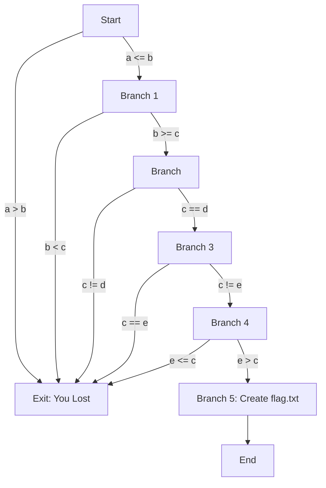

# Back To The Basics

Objectives

explain flow programs, logic gates(fork in the road, choices)
focus on conditionals, if then statments, what they look like in assembly
create a simple piece of code that utilizes all these.
The goal is to reach the last branch,
however the code is instanitated with values that will not meet a single condidtion
the code does not allow user input
must use debugger or patch it

As a bonus go over how programs use variables

In order to do ma we will need to foundationals. 

# Types of conditionals in assembly

| Assembly Instruction | Python Equivalent   | Description                                 |
|----------------------|---------------------|---------------------------------------------|
| JLE (Jump if Less or Equal) | `if a <= b:`         | Jumps if the first operand is less than or equal to the second. |
| JGE (Jump if Greater or Equal) | `if a >= b:`         | Jumps if the first operand is greater than or equal to the second. |
| JE (Jump if Equal) or JZ (Jump if Zero) | `if a == b:` or `if not a:` | Jumps if the operands are equal or if a previous operation resulted in zero. |
| JNE (Jump if Not Equal) or JNZ (Jump if Not Zero) | `if a != b:` or `if a:`   | Jumps if the operands are not equal or if a previous operation did not result in zero. |
| JG (Jump if Greater) | `if a > b:`          | Jumps if the first operand is strictly greater than the second. |
| JL (Jump if Less) | `if a < b:`          | Jumps if the first operand is strictly less than the second. |

# CMP and JMP

when you get to assebly you will notice CMP(compare) before every JMP(jump).

#
Like always create, compile, ensure working as expected.

# Open in ghidra

Something I noticed was as we patch the program it will show more of what is going on in C decompile. It seems the inital analysis didnt go down any impossible paths.

## go to main

notice our values being initialized

Here is the CMP and JG

Lets explain in deail what is happening here. focus in our first variable which = 6, respresented as hex 0x6. this value is being loaded into the variable or `RBP + local_c`. In the MOV before the CMP we can we the `RBP + local_c` is being put into EAX and the
and the CMP compares EAX(in this case 6) to `RBP + local_10`(in this case 2). our conditional is jump if greater, here 6 is greater than 2, so we would take the jump. 
Looking at the JG, it calls a function(`LAB_0010131e`) that leads us to the exit. So in this first situation we do not want to take the jump, that takes us to the exit, we to want to not jump and stay and the ride. 

We have 2 options in the debugger. Find values that satisfy the requierments, or flip the logic on each conditional.

# Patch the first branch

click on JG `ctrl+shift+G` change to the opposite, JLE.

Patch the binary and run it

We made it to the first branch. 

# final branch

C code filled out
