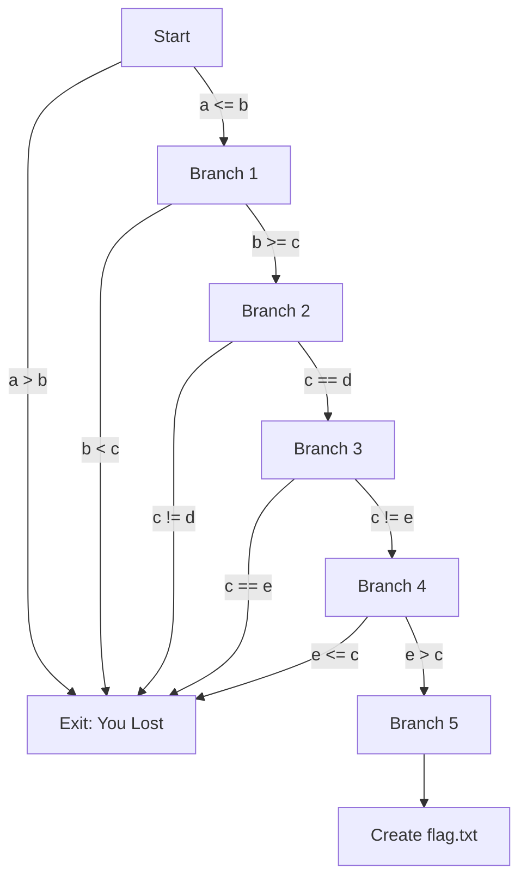

# Back To The Basics

Objectives

explain flow programs, logic gates(fork in the road, choices)
focus on conditionals, if then statments, what they look like in assembly
create a simple piece of code that utilizes all these.
The goal is to reach the last branch,
however the code is instanitated with values that will not meet a single condidtion
the code does not allow user input
must use debugger or patch it

As a bonus go over how programs use variables

In order to do ma we will need to foundationals. 

You can think of the flow of a program like water moving down a moutain, forming streams and rivers. In our example we want to control the flow, all water flows back to the ocean, but we want to make sure some of that water is captured in a resoivour.
Imagine we had gates at each bifiraction in a river, and using these gates we could control which path the water took. 

To tie this back to malware analysis. Using dynamic analysis we want to run malware and reach a function(for instance in ransomware we want to see how it is encrypting, what is the value of the key). However, more advanced malware will have
checks in it to make sure admin is running it, or it has connection to the internet, or it is not being debugged. If the malware detects these things or checks are not met, it will turn off, like water going back into the ocean.

# Types of conditionals in assembly

| Assembly Instruction | Python Equivalent   | Description                                 |
|----------------------|---------------------|---------------------------------------------|
| JLE (Jump if Less or Equal) | `if a <= b:`         | Jumps if the first operand is less than or equal to the second. |
| JGE (Jump if Greater or Equal) | `if a >= b:`         | Jumps if the first operand is greater than or equal to the second. |
| JE (Jump if Equal) or JZ (Jump if Zero) | `if a == b:` or `if not a:` | Jumps if the operands are equal or if a previous operation resulted in zero. |
| JNE (Jump if Not Equal) or JNZ (Jump if Not Zero) | `if a != b:` or `if a:`   | Jumps if the operands are not equal or if a previous operation did not result in zero. |
| JG (Jump if Greater) | `if a > b:`          | Jumps if the first operand is strictly greater than the second. |
| JL (Jump if Less) | `if a < b:`          | Jumps if the first operand is strictly less than the second. |

# CMP and JMP

when you get to assebly you will notice CMP(compare) before every JMP(jump).

CMP (Compare Instruction)

The CMP instruction is used to compare two operands. It essentially subtracts one operand from the other but does not store the result of this subtraction; instead, it updates the flags in the processor's status register based on the outcome. These flags include Zero Flag (ZF), Sign Flag (SF), Overflow Flag (OF), and Carry Flag (CF), among others.

Here’s what happens:

    If the operands are equal, the Zero Flag (ZF) is set (ZF=1).
    If the first operand is less than the second, the Sign Flag (SF) or the Carry Flag (CF) is set, depending on whether the operation is signed or unsigned.
    If the first operand is greater than the second, none of these specific flags are set (ZF=0, SF=0 for unsigned comparison).

JMP (Jump Instruction)

The JMP instruction is used to make unconditional or conditional jumps to other parts of the code. An unconditional jump (JMP) always redirects the flow of execution to the specified location. Conditional jumps depend on the status of the flags set by the preceding instructions like CMP.

#
Like always create, compile, ensure working as expected.

# Flow of the program

# Open in ghidra

Something I noticed was as we patch the program it will show more of what is going on in C decompile. It seems the inital analysis didnt go down any impossible paths.

## go to main

notice our values being initialized

* show what rBP looks like when all values are loaded in

show them in place

The reason that each of the local variables is 4 bytes apart in the stack frame is due to the size of the data type being used and the architecture of the system. In the assembly code snippet you provided, the variables are being stored as DWORD values. DWORD stands for "Double Word," which, on an x86 system architecture, is typically 4 bytes (32 bits) in size.

Here's why they are spaced 4 bytes apart:

    Data Type Size: When you declare a variable as a DWORD, you are allocating 4 bytes for that variable. The CPU and the compiler work together to ensure that each DWORD is properly aligned in memory. Proper alignment means that a variable's memory address is a multiple of its size.

    Memory Alignment: Most modern CPUs are designed to access data efficiently when the data is aligned to its size. For instance, 4-byte (32-bit) data types are aligned on 4-byte boundaries. This allows the CPU to read and write to memory in the most efficient manner. Misaligned access can lead to penalties in performance and, in some architectures, can even raise exceptions.

    Stack Organization: The stack is organized in such a way that each local variable can be accessed at a fixed offset from a base pointer, like RBP. Since each DWORD requires 4 bytes, the offsets for each variable are multiples of 4. This keeps the stack organized and simplifies the calculation of where each variable is stored.

    Consistency and Safety: Consistent spacing helps prevent errors such as buffer overflows, where data meant for one variable accidentally "spills over" into the space allocated for another variable. By ensuring each DWORD has its own 4-byte space, the program's memory management is more reliable and easier to debug.

The offsets you see (-0xc, -0x10, -0x14, etc.) are simply the distances from the base pointer RBP to where each local variable is stored. They are consistent with the size of the data type being stored and ensure that each variable has a unique location in memory that does not overlap with others.

Here is the first CMP and JG

Lets explain in deail what is happening here. focus in our first variable which = 6, respresented in hex as 0x6. this value is being loaded into the variable or `RBP + local_c`. In the MOV before the CMP we can we the `RBP + local_c` is being put into EAX 
and the CMP compares EAX(in this case 6) to `RBP + local_10`(in this case 2). our conditional is jump if greater, here 6 is greater than 2, so we would take the jump. 
Looking at the JG, it calls a function(`LAB_0010131e`) that leads us to the exit `You lost`. So we do not want to take the jump, We want stay and the ride. 

show value loaded in EAX

We have 2 options in the debugger. Find values that satisfy the requierments, or flip the logic on each conditional.

# Patch the first branch

click on JG `ctrl+shift+G` change to the opposite, JLE.

Patch the binary and run it

We made it to the first branch. 

# final branch

## 

At this point you should feel comfortable, identifiying and patching the jmps, effectivly controlling the flow.

Im still not sure why the logic isnt more detailed during the inital analysis, but the continial upgrade can be usefule to see if you made the correct change to the logic

